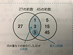

# Part 1
###
- 整数のたし算
- 整数の引き算
- 整数のかけ算
- 整数の割り算
- 計算の順番

---

### 整数の足し算
$$ 7 + 7 = 14 $$

### 整数の引き算
$$ 7 - 7 = 0 $$

### 整数のかけ算
$$ 7 * 7 = 49 $$

### 整数の割り算
$$ 7 / 7 = 1 $$

### 計算の順番
括弧の中を一番先に
[*, /]は[+,-]より先に
左から

---

# Part 3
###
- 約数とは
- 公約数と最大公約数
- 倍数とは
- 公倍数と最大公倍数
- 偶数と奇数

---

### 約数とは
ある整数を割り切ることのできる整数


### 約数の解き方
オリを使う解きかたで、書きもれを防ぐ
（例）36の約数
|1|2|3|4|6|
|:-:|:-:|:-:|:-:|:-|
|36|18|12|9||

---

### 公約数と最大公約数
- 公約数
2つ以上の整数に共通する約数

- 最大公約数
公約数のうち、最も大きい数

### 問題の解き方
ベン図を利用して公約数を探す
（例）27と45の公約数


---
### 倍数とは
ある整数の整数倍になっている数
＝ある整数で割り切れる数

（例）12の倍数
|12|24|36|48|60|72|...|
|:-:|:-:|:-:|:-:|:-:|:-:|:-|
|12×1|12×2|12×3|12×4|12×5|12×6|...|

---

### 公倍数と最小公倍数
- 公倍数
2つ以上の整数に共通する倍数

- 最小公倍数
公倍数のうち、最も小さい数

### 問題の解き方
ベン図を利用して公倍数を探す
（例）10と15の公約数


---

### 偶数と奇数、素数
- 偶数
2で割り切れる整数＝2の倍数

- 奇数
2で割り切れない整数＝2の倍数+1

- 素数
1とその数自身しか約数がない数＝約数が２つだけの整数

（例）1,2,4,15,24,29,33
　偶数：2,4,24
　奇数：1,15,29,33
　素数：2,29

---

# Part 4

- 分数とは
$$ \frac{2}{5}$$
- 真分数
$$ \frac{1}{5}$$
- 仮分数
$$ \frac{5}{5} or \frac{5}{2}$$
- 帯分数
$$ 3\frac{2}{5}$$

---

### 仮分数、帯分数 → 整数
```
5 / 3 = 1 ... 2
```
$$ \frac{5}{3} = 1\frac{2}{3}$$

### 帯分数 → 仮分数

$$ 2\frac{2}{3} = \frac{2 * 3 +2}{3} =\frac{8}{3}$$

---

### 約分
最大公約数で割る
$$ \frac{24}{32} = \frac{24 / 8}{32 / 8} =\frac{3}{4}$$

### 通分
最小公倍数にそろえる
$$ \frac{5}{7},\frac{3}{4} = \frac{5 * 4}{7 * 4},\frac{3 * 7}{4 * 7} =\frac{20}{28},\frac{21}{28} $$

---

### 分数と少数の変換
$$ 2\frac{7}{20} = 2+ \frac{7}{20}= 2+(7/20) = 2+(0.35)=2.35$$

### 帯分数のくり上げ
$$ 3\frac{16}{13}= 3 +\frac{16}{13}=3 +1\frac{3}{13}=4\frac{3}{13}$$

### 帯分数のくり下げ
$$ 3\frac{1}{13}= 2 +1\frac{1}{13}=2 +\frac{14}{13}=2\frac{14}{13}$$

---

### 分数のたし算
$$ \frac{3}{5}+\frac{3}{5}=  \frac{6}{5}=1\frac{1}{5}$$
$$ \frac{3}{5}+\frac{3}{2}=  \frac{6}{10}+\frac{15}{10}=\frac{21}{10}=2\frac{1}{10}$$

### 分数の引き算
$$ 3\frac{2}{5}-\frac{3}{5}= 2\frac{7}{5}-\frac{3}{5}=  2\frac{4}{5}$$
$$ \frac{3}{2}-\frac{3}{5}=  \frac{15}{10}-\frac{6}{10}=\frac{9}{10}$$

---

### 分数のかけ算
$$ \frac{3}{2}*\frac{3}{5}=  \frac{3 * 3}{2 * 5}=\frac{9}{10}$$

### 分数の割り算
$$ \frac{3}{2}/\frac{3}{5}=   \frac{3}{2}*\frac{5}{3}=\frac{3 * 5}{2 * 3}=\frac{15}{6}=\frac{5}{2}$$

---

# Part 7

- 平均 = 合計 / 個数
- 個数 = 合計 / 平均
- 合計 = 平均 * 個数

---

### 単位量あたりの大きさ
- 1m2あたり２人
- 1Lあたり15ｋｍ
- 1mあたり30g

---
### 人口密度 = 人口 / 面積

|  | 面積 (m2) | 人数 (人) |
| --- | --- | --- |
| 南公園 | 170 | 20|
| 北公園 | 130 | 10|

20 / 170 = 0.11764...人(1m2あたり)
10 / 130 = 0.0769....人(1m2あたり)

### 様々な単位
| 1/1000 | 1 | 1 * 1000 |
| --- | --- | --- |
| 1mm | 1m | 1km |
| 1mg | 1g | 1kg|
| 1mL | 1L | 1kL|

---
### cm2 と m2の関係
- 1m2が何cm2か
1m2 = 1m * 1m = 100cm * 100cm = 10,000cm2

### cm3 と m3の関係
- 1m3が何cm3か
1m3 = 1m * 1m * 1m = 100cm * 100cm * 100cm = 1,000,000cm3

---


|   | 1倍 | 10倍 | 100倍 | 1000倍 |
| --- | --- | --- | --- | --- |
| 長さ | 1mm | 1cm | 1m | 1km |
| 重さ| 1mg | 1g | 1kg | 1t |

| | 1倍 | 10倍 | 100倍 | 100倍 | 1000倍 |
| --- | --- | --- | --- | --- | --- |
| 面積 | 1cm2 | 1m2 | 1a | 1ha | 1km2 |

| | 1倍 | 100倍 | 10倍 | 1000倍 |
| --- | --- | --- | --- | --- |
|体積、容積 | 1cm3 = 1mL | 1dL | 1L | 1m3 = 1kL |

---

### 単位の換算
- 2.15kg = ?g
1kg = 1000g 
2.15 * 1000 = 2150g
- 35cm = ?m
1m = 100cm 
35 / 100 = 0.35m


